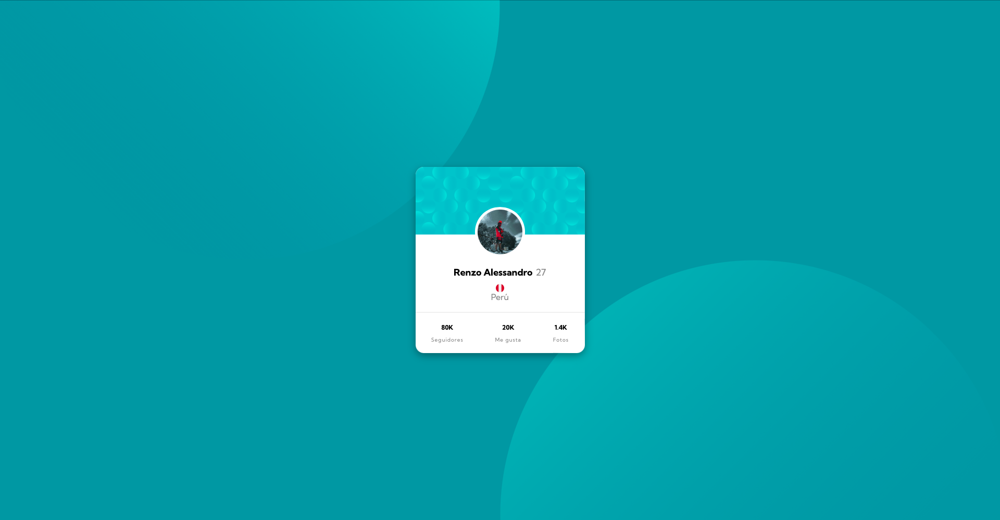

# Frontend Mentor - Profile card component solution

This is a solution to the [Profile card component challenge on Frontend Mentor](https://www.frontendmentor.io/challenges/profile-card-component-cfArpWshJ). Frontend Mentor challenges help you improve your coding skills by building realistic projects. 

## Table of contents

- [Overview](#overview)
  - [The challenge](#the-challenge)
  - [Screenshot](#screenshot)
  - [Links](#links)
- [My process](#my-process)
  - [Built with](#built-with)
  - [Useful resources](#useful-resources)
- [Author](#author)

## Overview

### The challenge

- Build out the project to the designs provided

### Screenshot

### Links

- Solution URL: [Solution URL](https://github.com/RenzoAlessandro/profile-card-component.gitm)
- Live Site URL: [Live site URL](https://your-live-site-url.com)

## My process

### Built with

- Semantic HTML5 markup
- SASS and CSS custom properties
- Flexbox

### Useful resources

- [Flexbox](https://css-tricks.com/snippets/css/a-guide-to-flexbox/) - A Complete Guide to Flexbox
- [Color HSL](https://developer.mozilla.org/es/docs/Web/CSS/color_value) -  HSL cylindrical-coordinate
- [Normalize.css](https://necolas.github.io/normalize.css/) -  A modern, HTML5-ready alternative to CSS resets
- [Sass Basics](https://sass-lang.com/guide/) - Learn Sass

## Author

- Github - [Renzo Alessandro Sucari Velásquez](https://github.com/RenzoAlessandro/)
- Frontend Mentor - [@RenzoAlessandro](https://www.frontendmentor.io/profile/yourusername)
